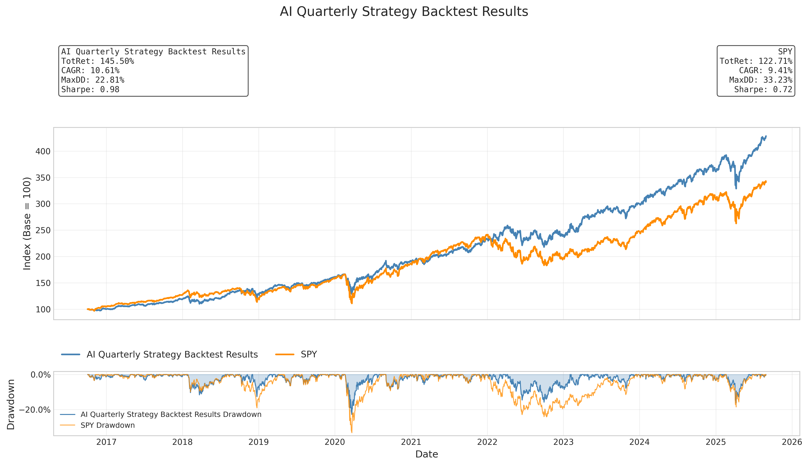
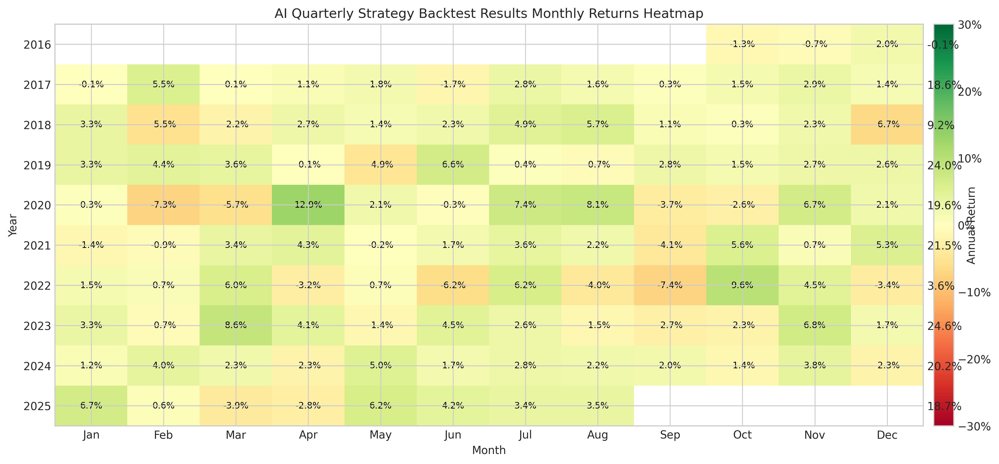
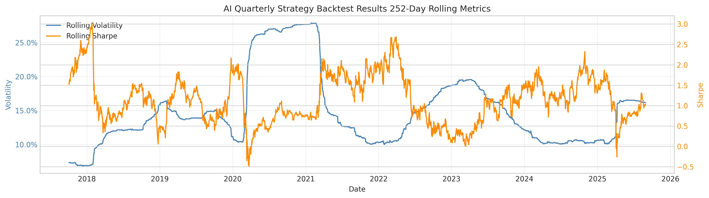
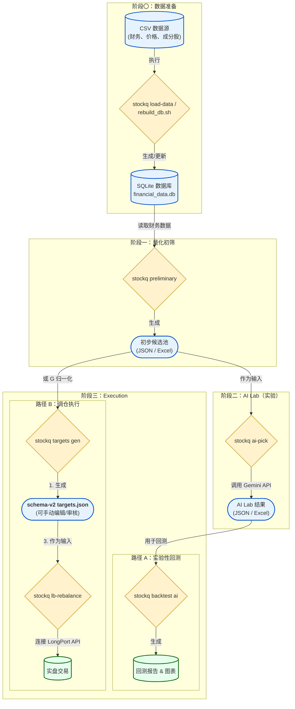

# 量化研究、AI Lab 与执行平台

该项目现在按三个逻辑边界组织，但仍保留在同一个仓库中：

- `research`：数据准备、规则量化选股、组合快照生成与回测，是项目主线。
- `ai-lab`：基于 `gemini-2.5-pro` 的实验性股票筛选与解释生成，不作为 canonical strategy。
- `execution`：基于 canonical `targets.json` 的账户快照、调仓规划、审计与 LongPort 执行入口。

项目利用`SQLite`进行数据管理，并通过`config/config.yaml`进行统一配置。所有核心操作都通过`stockq`命令行工具执行。

## 回测结果图

> 相比SPY，该策略有相对更低的回撤（22.81% vs 33.23%），更高的夏普比率（0.984 vs 0.721），以及略微更高的总收益（145.50% vs 122.71%）

### 收益率曲线和回测对比



### 每月损益热力图



### 252天滚动夏普比率和波动率



### 数据面板

```bash
==================================================
      AI Quarterly Strategy Backtest Results
==================================================
Time Period Covered:     2016-10-04 to 2025-08-31
Initial Portfolio Value: $1,000,000.00
Final Portfolio Value:   $4,284,430.93
--------------------------------------------------
Total Return:            145.50%
Annualized Return:       10.61%
Max Drawdown:            22.81%
Sharpe Ratio:           0.984
Risk-free Series:       DGS3MO
==================================================

==================================================
              SPY Benchmark Results
==================================================
Time Period Covered:     2016-10-04 to 2025-08-29
Initial Portfolio Value: $1,000,000.00
Final Portfolio Value:   $3,411,410.08
--------------------------------------------------
Total Return:            122.71%
Annualized Return:       9.41%
Max Drawdown:            33.23%
Sharpe Ratio:           0.721
Risk-free Series:       DGS3MO
==================================================

Benchmark Comparison (Unified Methodology):
Metric              AI Quarterly Strategy BacktestSPY
--------------------------------------------------------------------------------
Total Return        145.50%                       122.71%
Annualized Return   10.61%                        9.41%
Max Drawdown        22.81%                        33.23%
Sharpe Ratio        0.984                         0.721
--------------------------------------------------------------------------------
Period Covered:2016-10-04 to 2025-08-31 | 2016-10-04 to 2025-08-29
Initial / Final: $1,000,000.00 → $4,284,430.93 | $1,000,000.00 → $3,411,410.08
Risk-free Series: DGS3MO

Segmented Performance (ending on latest observation):
Horizon           CAGR     MaxDD    Calmar   Sortino       Vol     InfoR  TrackErr
----------------------------------------------------------------------------------
Last 1Y         21.73%   -16.22%      1.34      1.04    16.21%      0.53     7.66%
Last 3Y         21.21%   -16.22%      1.31      1.09    14.43%      0.28     7.46%
Last 5Y         17.97%   -16.22%      1.11      0.98    14.32%      0.31     8.32%
```

## 目录
<!-- START doctoc generated TOC please keep comment here to allow auto update -->
<!-- DON'T EDIT THIS SECTION, INSTEAD RE-RUN doctoc TO UPDATE -->

- [快速开始](#%E5%BF%AB%E9%80%9F%E5%BC%80%E5%A7%8B)
  - [Research（主线）](#research%E4%B8%BB%E7%BA%BF)
  - [AI Lab（实验性）](#ai-lab%E5%AE%9E%E9%AA%8C%E6%80%A7)
  - [Execution](#execution)
  - [配置环境](#%E9%85%8D%E7%BD%AE%E7%8E%AF%E5%A2%83)
  - [阶段一：数据准备与量化初筛](#%E9%98%B6%E6%AE%B5%E4%B8%80%E6%95%B0%E6%8D%AE%E5%87%86%E5%A4%87%E4%B8%8E%E9%87%8F%E5%8C%96%E5%88%9D%E7%AD%9B)
  - [阶段二：AI Lab（实验）与可选回测](#%E9%98%B6%E6%AE%B5%E4%BA%8Cai-lab%E5%AE%9E%E9%AA%8C%E4%B8%8E%E5%8F%AF%E9%80%89%E5%9B%9E%E6%B5%8B)
  - [阶段三：Execution（长桥）](#%E9%98%B6%E6%AE%B5%E4%B8%89execution%E9%95%BF%E6%A1%A5)
- [可选步骤](#%E5%8F%AF%E9%80%89%E6%AD%A5%E9%AA%A4)
  - [导出与一致性校验（Excel ↔ JSON）](#%E5%AF%BC%E5%87%BA%E4%B8%8E%E4%B8%80%E8%87%B4%E6%80%A7%E6%A0%A1%E9%AA%8Cexcel--json)
- [核心特性](#%E6%A0%B8%E5%BF%83%E7%89%B9%E6%80%A7)
- [核心策略流程](#%E6%A0%B8%E5%BF%83%E7%AD%96%E7%95%A5%E6%B5%81%E7%A8%8B)
  - [阶段一：多因子量化初筛](#%E9%98%B6%E6%AE%B5%E4%B8%80%E5%A4%9A%E5%9B%A0%E5%AD%90%E9%87%8F%E5%8C%96%E5%88%9D%E7%AD%9B)
  - [阶段二：Gemini AI Lab（实验性）](#%E9%98%B6%E6%AE%B5%E4%BA%8Cgemini-ai-lab%E5%AE%9E%E9%AA%8C%E6%80%A7)
- [项目流程图](#%E9%A1%B9%E7%9B%AE%E6%B5%81%E7%A8%8B%E5%9B%BE)
- [项目结构](#%E9%A1%B9%E7%9B%AE%E7%BB%93%E6%9E%84)
- [数据源](#%E6%95%B0%E6%8D%AE%E6%BA%90)
- [输出文件](#%E8%BE%93%E5%87%BA%E6%96%87%E4%BB%B6)
- [如何运行](#%E5%A6%82%E4%BD%95%E8%BF%90%E8%A1%8C)
  - [准备工作: 环境设置](#%E5%87%86%E5%A4%87%E5%B7%A5%E4%BD%9C-%E7%8E%AF%E5%A2%83%E8%AE%BE%E7%BD%AE)
- [JSON格式选股提示词](#json%E6%A0%BC%E5%BC%8F%E9%80%89%E8%82%A1%E6%8F%90%E7%A4%BA%E8%AF%8D)
- [测试](#%E6%B5%8B%E8%AF%95)
- [标记规范](#%E6%A0%87%E8%AE%B0%E8%A7%84%E8%8C%83)
  - [快速开始](#%E5%BF%AB%E9%80%9F%E5%BC%80%E5%A7%8B-1)
  - [覆盖率](#%E8%A6%86%E7%9B%96%E7%8E%87)
  - [环境要求（仅集成/E2E）](#%E7%8E%AF%E5%A2%83%E8%A6%81%E6%B1%82%E4%BB%85%E9%9B%86%E6%88%90e2e)
  - [目录结构](#%E7%9B%AE%E5%BD%95%E7%BB%93%E6%9E%84)
- [环境变量](#%E7%8E%AF%E5%A2%83%E5%8F%98%E9%87%8F)

<!-- END doctoc generated TOC please keep comment here to allow auto update -->

## 快速开始

所有操作均通过`stockq`命令行工具完成。

推荐按以下 workflow 使用：

### Research（主线）

- `stockq load-data`
- `stockq preliminary`
- `stockq backtest quant`
- `stockq backtest pe`
- `stockq backtest spy`

### AI Lab（实验性）

- `stockq ai-pick`
- `stockq backtest ai`

> `ai-pick` 属于实验性 workflow，适合做候选重排、解释生成和研究假设辅助，不应默认视为实盘 canonical signal。

### Execution

- `stockq targets gen --from preliminary`
- `stockq targets gen --from ai`
- `stockq lb-account --format json`
- `stockq lb-rebalance outputs/targets/YYYY-MM-DD.json`

常用辅助命令：

- `stockq export`: 在 Excel 和分期 JSON 之间双向转换。
- `stockq validate-exports`: 校验 Excel 与 JSON 的一致性。
- `stockq lb-config`: 显示 LongPort 相关环境配置。
- `stockq targets gen`: 将 research 或 ai-lab 结果归一化为 canonical schema-v2 `targets.json`，推荐作为实盘起点。
- `stockq rf info`: 查看/刷新无风险利率（FRED）缓存状态，供 Sharpe 计算复用。

### 配置环境

* 支持的 Python 版本：3.10、3.11、3.12（CI 将覆盖上述版本）
* 安装依赖: `uv sync`

* 复制 `.env.example` 为 `.env` 并填入你的 API 密钥。

* 复制 `config/template.yaml` 为 `config/config.yaml`。

无风险利率（Sharpe 计算）相关配置示例：

```yaml
risk_free:
  series: DGS3MO        # 默认使用 3 个月美债收益率
  ttl_days: 5           # 缓存超过 5 天自动刷新（设为 null 禁用）
  fallback_rate: null   # API 异常时是否使用常量兜底（null=禁用，建议保留 null）
```

> CLI 会读取同一份配置：`stockq rf update --series DGS1 --force` 可按需覆盖。

Sharpe 计算在回测阶段会自动尝试按需求预热缓存，若仍缺少数据会给出明确提示（含 `stockq rf update --start ... --end ...` 命令）。

回测报告相关开关集中在 `report` 段，可统一控制文本输出与附加图表：

```yaml
report:
  report_mode: both       # comparison_only | strategy_only | both
  with_underwater: true   # 是否绘制回撤图
  index_to_100: true      # 净值曲线是否按 100 归一
  use_log_scale: false    # 净值曲线是否使用对数坐标
  show_rolling: true      # 是否绘制滚动波动率/Sharpe
  rolling_window: 252     # 滚动窗口（交易日）
  show_heatmap: true      # 是否绘制月度收益热力图
```

环境变量要点（.env）：

| 变量                                       | 示例          | 说明                                  |
| ------------------------------------------ | ------------- | ------------------------------------- |
| `GEMINI_API_KEY[_2,_3]`                    | `xxxx`        | Gemini API 密钥（可多把，轮换限流）   |
| `FRED_API_KEY`                             | `xxxx`        | FRED 数据接口密钥（用于无风险利率）   |
| `LONGPORT_REGION`                          | `cn`          | 长桥区域：`hk` 或 `cn`                |
| `LONGPORT_ENABLE_OVERNIGHT`                | `true`        | 是否启用隔夜行情（预览友好）          |
| `LONGPORT_APP_KEY` / `LONGPORT_APP_SECRET` | `...`         | 长桥应用凭据                          |
| `LONGPORT_ACCESS_TOKEN`                    | `...`         | 真实账户访问令牌                      |
| `LONGPORT_DEFAULT_ENV`                     | `real`        | 默认账户环境（当前实现仅使用 `real`） |
| `LONGPORT_MAX_NOTIONAL_PER_ORDER`          | `20000`       | 本地单笔名义金额上限（0=不限制）      |
| `LONGPORT_MAX_QTY_PER_ORDER`               | `500`         | 本地单笔数量上限（0=不限制）          |
| `LONGPORT_TRADING_WINDOW_START/END`        | `09:30/16:00` | 本地交易时间窗（降级判定）            |

可选成本模型与碎股预览（config.yaml）：

```yaml
# 复制 config/template.yaml 为 config/config.yaml 后可按需开启
fees:
  domicile: HK
  commission: 0.0
  platform_per_share: 0.005
  fractional_pct_lt1: 0.012
  fractional_cap_lt1: 0.99
  sell_reg_fees_bps: 0.0

fractional_preview:
  enable: true
  default_step: 0.001
```

> fractional_preview 功能用于在生成调仓计划时，预览如果支持碎股交易，理想的目标股数会是多少，以及当前整数股交易策略与理想状态的差异。


### 阶段一：数据准备与量化初筛

1. 步骤 1：只导财报数据进sqlite数据库，跳过价格

    ```bash
    stockq load-data --skip-prices
    ```

2. 步骤 2: 运行量化初筛策略

    此脚本执行多因子选股逻辑，并将每个季度的前20名候选股保存到`outputs/`目录的 Excel 总表和分期 JSON 文件中。

    ```bash
    stockq preliminary
    ```

### 阶段二：AI Lab（实验）与可选回测

3. 步骤 3: 运行 AI 筛选策略

    此脚本读取上一步生成的候选结果，提交给`gemini-2.5-pro`进行实验性分析，并将 AI 选出的 10 只股票及其分析理由保存到新的 Excel 文件，同时输出对应的 JSON 文件。

    ```bash
    stockq ai-pick
    ```

    JSON/Excel 并行输出：

    - 默认同时写 Excel 总表和分期 JSON 文件。
    - 仅写 JSON：追加 `--no-excel`
    - 仅写 Excel：追加 `--no-json`

    目录结构（示例）：

    - `outputs/preliminary/YYYY/YYYY-MM-DD.json`
    - `outputs/ai_pick/YYYY/YYYY-MM-DD.json`

    提示：AI JSON 可由 `stockq ai-pick` 直接生成，或通过
    `stockq export --from ai --direction excel-to-json` 从 AI 总表导出。

4. 导入价格数据进sqlite数据库

    ```bash
    生成白名单（从初筛 Excel 聚合去重，按时间窗筛 sheet）
    stockq gen-whitelist --from preliminary --out outputs/selected_tickers.txt --date-start 2016-10-01 --date-end 2025-09-01

    可选：AI 精选作为来源
    stockq gen-whitelist --from ai --out outputs/selected_tickers.txt --date-start 2016-10-01 --date-end 2025-09-01

    仅导白名单价格，并裁日期
    stockq load-data --only-prices --tickers-file outputs/selected_tickers.txt --date-start 2016-10-01 --date-end 2025-09-01
    ```

    * 不传 --excel 时，回测默认优先读取：

        * 初筛：`outputs/preliminary/`（按日期拆分的 JSON 文件）
        * AI：`outputs/ai_pick/`（按日期拆分的 JSON 文件）

      若上述目录不存在，则回退到 Excel：

        * 初筛：`outputs/point_in_time_backtest_quarterly_sp500_historical.xlsx`
        * AI：`outputs/point_in_time_ai_stock_picks_all_sheets.xlsx`

5. （推荐）预热无风险利率缓存（Sharpe 所需）

    无风险利率序列按需自动刷新，但首次回测前可手动预热，避免 CLI 第一次运行时命中 FRED 限流。

    ```bash
    # 覆盖 AI/量化回测涉及的时间窗
    stockq rf update --start 2016-01-01 --end 2025-12-31

    # 查看缓存范围与最近刷新时间
    stockq rf info
    ```

6. 运行 AI 筛选组合的回测（实验性）

    此脚本读取 AI Lab 生成的股票列表，使用`backtrader`引擎进行回测，并生成累计收益图和性能指标。默认情况下，它会优先从 `outputs/ai_pick/` 和 `outputs/preliminary/` 目录中按日期读取 JSON 文件；若缺失则回退到对应的 Excel 文件。

    ```bash
    stockq backtest ai
    ```

> 关于回测图表：默认在水下图中以填充展示策略回撤，同时叠加基准的表现。净值面板左上角/右上角会自动嵌入策略与基准的关键指标（TotRet、CAGR、MaxDD、Sharpe），方便对比。所有图表与文本输出开关都集中在 `config.yaml` 的 `report` 段，可切换 `report_mode`、启用/禁用滚动波动率与月度收益热力图、调整滚动窗口或是否对数坐标。

### 阶段三：Execution（长桥）

5. 查看当下账户情况

    在执行任何交易操作前，先验证 API 连接和账户状态（默认连接真实账户，预览不下单）。

    ```bash
    # 查看LongPort相关环境配置（区域、隔夜、上限、交易时段等）
    stockq lb-config --show

    # 验证API凭据和实时报价功能是否正常
    stockq lb-quote AAPL MSFT

    # 查看真实账户
    stockq lb-account

    # 只看资金或只看持仓
    stockq lb-account --funds
    stockq lb-account --positions

    # 机器可读
    stockq lb-account --format json
   ```

6. 生成 canonical 调仓目标（targets JSON）

    为避免“回测产物 = 实盘目标”的耦合，推荐先从最新一期 research 或 ai-lab 结果生成一份独立的 schema-v2 `targets.json`（可手动修订）。

    ```bash
    # 从最新 AI Lab JSON 生成 outputs/targets/{YYYY-MM-DD}.json
    stockq targets gen --from ai

    # 从最新 research JSON 生成
    stockq targets gen --from preliminary

    # 指定日期（按 outputs/ai_pick/YYYY/{asof}.json 匹配）
    stockq targets gen --from ai --asof 2025-09-05

    # 或显式指定旧版 Excel/日期/输出位置（迁移旧流程）
    stockq targets gen --from ai \
      --excel outputs/point_in_time_ai_stock_picks_all_sheets.xlsx \
      --asof 2025-09-05 \
      --out outputs/targets/2025-09-05.json
    ```

    你可以手动编辑这份 JSON（增加/删除票、修改权重、补充备注），上游 research / ai-lab 产物不会被污染。

    schema-v2 `targets.json` 示例：

    ```json
    {
      "schema_version": 2,
      "asof": "2025-09-05",
      "source": "research",
      "target_gross_exposure": 1.0,
      "targets": [
        {"symbol": "AAPL", "market": "US", "target_weight": 0.5},
        {"symbol": "MSFT", "market": "US", "target_weight": 0.5}
      ]
    }
    ```

    每个 target 必须显式携带 `symbol` 与 `market`，并且只能使用一种目标表达：`target_weight` 或 `target_quantity`。

7. 使用 targets JSON 干跑预览 / 执行调仓

    `lb-rebalance` 命令默认读取真实账户并生成调仓计划，但不下单；只有添加 `--execute` 时才会真实下单。执行入口只接受 canonical schema-v2 `targets.json`。

    干跑预览（推荐先预览）:

    ```bash
    # 使用 targets JSON（推荐）
    stockq lb-rebalance outputs/targets/2025-07-02.json
    ```

    审查输出后，如需执行真实交易（谨慎）:

    ```bash
    stockq lb-rebalance outputs/targets/2025-09-05.json --execute
    ```

## 可选步骤

* 创建数据库（WSL/Linux 全量重建）

    使用一键全量重建脚本，跨平台、可重复：

    ```bash
    bash scripts/rebuild_db.sh
    ```

    该脚本将：
    - 用 `sqlite3 .import` 高速导入价格数据（`data/us-shareprices-daily.csv`）。

    - 调整并导入财报数据到 `balance_sheet`/`cash_flow`/`income`（通过现有 Python 逻辑完成字段重命名与清洗）。

    - 建立必要索引并优化数据库。

    如需最简方式也可执行（但由于没有调用sqlite原生基于C语言设计的导入机制，所以速度更慢）：

    ```bash
    stockq load-data
    ```

    可选参数：

    - 仅导入价格：`stockq load-data --only-prices`

    - 跳过价格（仅导入财报）：`stockq load-data --skip-prices`

    - 只导白名单价格（并裁日期）：`stockq load-data --only-prices --tickers-file outputs/selected_tickers.txt --date-start 2015-01-01 --date-end
  2025-07-02`

* 对比回测 1 (量化初筛组合): 评估纯量化策略（未经过 AI 筛选的 20 只股票组合）的表现。

    ```bash
    stockq backtest quant
    ```

* 对比回测 2 (SPY 基准)：评估 AI 策略与 SPY 基准（S&P 500 ETF）的表现（含分红再投资）。

    ```bash
    # 基准含DRIP（分红再投），默认用 99% 仓位，留 1% 现金缓冲
    stockq backtest spy
    
    # 调整目标仓位 & 日志级别（仅对 backtest 生效）
    stockq backtest spy --target 1.0 --log-level debug
    
    # 同样可为策略回测调整日志级别（分红与再平衡日志更详细）
    stockq backtest ai --log-level info
    stockq backtest quant --log-level debug
    ```

### 导出与一致性校验（Excel ↔ JSON）

- Excel → 多个 JSON（按调仓日分文件）

    ```bash
    # 初筛
    stockq export --from preliminary --direction excel-to-json

    # AI 精选
    stockq export --from ai --direction excel-to-json
    ```

- 多个 JSON → Excel（每个调仓日一张工作表）

    ```bash
    # 初筛
    stockq export --from preliminary --direction json-to-excel

    # AI 精选
    stockq export --from ai --direction json-to-excel
    ```

- 校验 Excel 与 JSON 是否一致

    ```bash
    stockq validate-exports --source preliminary
    stockq validate-exports --source ai
    ```

可选参数：`--excel` 指定Excel路径，`--json-root` 指定JSON根目录，`--overwrite` 控制excel→json是否覆盖已存在文件。

额外的 JSON 健康检查（工具脚本）

- 深度校验 AI JSON 的字段规范、rank 连续性、候选映射与与 preliminary 的日期覆盖：

  ```bash
  python tools/validate_ai_pick_jsons.py
  ```
  非零退出码代表校验失败，方便在 CI 中使用。

## 核心特性

* 三个逻辑边界:

    * `research`: 数据准备、规则量化选股、组合快照与回测，是项目主线。

    * `ai-lab`: AI 候选重排、解释生成与实验性回测，不作为默认实盘信号。

    * `execution`: 账户快照、canonical targets、差分调仓、审计与券商执行。

* 时点回测:

    * 避免幸存者偏差: 在每个调仓日，选股范围限定为当时的 S&P 500 指数成分股。

    * 杜绝未来数据: 使用财报的发布日期（Publish Date）作为判断信息是否可用的标准。

* AI Lab（实验性）:

    * 多API密钥池: 支持配置多个Gemini API密钥，通过轮换机制分摊请求压力，最大化吞吐量。

    * 智能容错与限速: 内置一套API 管理系统，包括：

        * 滑动窗口限速器: 为每个API Key精确控制请求频率，避免超出 QPM (每分钟查询数) 限制。

        * 指数退避重试: 对临时性网络或服务器错误采用带“抖动”的指数退避策略进行重试。

        * 熔断器机制: 当某个 Key 连续失败时，系统会将其暂时“熔断”并移出工作池，防止连锁失败。

        * 分级错误处理: 系统能自动区分API Key认证失败（永久移除）、项目级限流（全局冷却）和临时性网络错误（单Key临时退避），确保在高并发请求下依然稳健运行。

* Canonical 调仓协议: execution 侧使用 market-aware 的 schema-v2 `targets.json`，将策略产物与实盘输入解耦。

* 命令行工具: 通过`stockq`命令及其子命令（如`load-data`, `ai-pick`, `backtest`, `targets`, `lb-rebalance`）执行 research、ai-lab 与 execution 工作流。

* Sharpe 比率自动化: 回测时自动读取/刷新 FRED 无风险利率缓存，输出 Sharpe Ratio 与所用序列，亦可通过 `stockq rf` 独立维护缓存。

* 集中化配置: 所有回测参数（如时间范围、初始资金）均在`config/config.yaml`中统一管理，便于快速调整和复现实验。

* 模块化与可测试的代码: 项目被重构为逻辑清晰的模块（如`backtest`, `utils`），并配备了`pytest`单元测试，保证了核心逻辑的正确性。

* 券商集成 (长桥): 项目已集成LongPort OpenAPI，可通过命令行工具直接获取股票的实时报价，并根据 canonical `targets.json` 生成并执行调仓交易指令。

## 核心策略流程

当前工作流以 `research` 主线为核心，并提供可选的 `ai-lab` 与 `execution` 路径：

### 阶段一：多因子量化初筛

此阶段利用财务数据快速筛选出一个具备良好基本面特征的股票池。

1. 多因子模型: 结合多个财务指标来综合评估公司质量。本策略使用的因子及其权重在 `src/stock_analysis/research/selection/preliminary_selection.py` 的 `FACTOR_WEIGHTS` 中定义。

    * `cfo` (经营活动现金流): 正向因子，越高越好。

    * `ceq` (总股东权益): 正向因子，越高越好。

    * `txt` (所得税): 正向因子，正的所得税通常意味着公司在盈利。

    * `d_txt` (所得税变化量): 正向因子，所得税的增加可能意味着盈利能力的提升。

    * `d_at` (总资产变化量): 负向因子，总资产的过度扩张可能带来风险。

    * `d_rect` (应收账款变化量): 负向因子，应收账款的快速增加可能是销售质量下降的信号。

2. 滚动窗口平滑: 采用 5 年滚动窗口计算因子得分的平均值，以获得更稳健的排名。

3. 初步筛选: 在每个季度，选出滚动平均因子分排名前20的股票，作为 AI 分析的候选列表。

### 阶段二：Gemini AI Lab（实验性）

此阶段利用大型语言模型对初选列表进行更深层次的定性与半定量分析，作为实验性候选重排与解释生成路径。

1. AI 分析框架: `src/stock_analysis/ai_lab/selection/ai_stock_pick.py` 为每个季度的前20名候选股构建详细提示，要求 Gemini 模型扮演价值投资者的角色，从基本面、投资逻辑、行业地位和催化因素四个维度进行分析。

    * 基本面分析: 审视营收、利润率和现金流的健康状况。

    * 投资逻辑验证: 阐述核心投资逻辑及主要风险。

    * 行业与宏观视角: 结合当时的宏观经济环境评估公司竞争力。

    * 催化因素观察: 识别潜在的短期或中期催化剂。

2. AI 决策: Gemini 模型根据上述框架，从20只候选股中筛选出它认为最具投资潜力的10只股票，并为每只股票提供一个置信度分数和详细的选股理由。

3. 结构化输出: AI 的选股结果被解析为结构化的 JSON 数据，便于后续分析和回测。

## 项目流程图



## 项目结构

```tree
.
├── config/
│   ├── config.yaml               # 核心配置文件
│   └── template.yaml             # 配置模板
├── data/
│   └── ... (原始CSV数据)
├── outputs/
│   └── ... (脚本生成的报告、图表和日志)
├── src/
│   └── stock_analysis/
│       ├── __init__.py
│       ├── cli.py                   # 兼容入口，转发到 app/cli.py
│       ├── app/                     # CLI / command dispatch
│       │   ├── cli.py
│       │   └── commands/
│       ├── research/                # 主线研究域
│       │   ├── backtest/            # 回测引擎、数据准备、研究策略
│       │   ├── data/                # 数据装载
│       │   └── selection/           # 规则选股
│       ├── ai_lab/                  # 实验性 AI 工作流
│       │   ├── backtest/
│       │   └── selection/
│       ├── execution/               # 执行平台
│       │   ├── broker/              # Broker adapter
│       │   ├── renderers/           # 调仓 diff / 执行渲染
│       │   └── services/            # 账户快照 / 调仓规划 / 执行
│       ├── contracts/               # 跨工作流共享协议
│       │   ├── portfolio_json.py
│       │   └── targets.py
│       └── shared/                  # 共享基础设施与通用工具
│           ├── config/
│           ├── io/
│           ├── logging/
│           ├── services/
│           ├── utils/
│           ├── fees.py
│           └── models.py
├── .env
├── pyproject.toml
└── README.md
```

## 数据源

项目需要以下位于`data/`目录的原始 CSV 文件：

1. `us-balance-ttm.csv`: 资产负债表数据 (TTM)。

2. `us-cashflow-ttm.csv`: 现金流量表数据 (TTM)。

3. `us-income-ttm.csv`: 利润表数据 (TTM)。

4. `us-shareprices-daily.csv`: 日频股价数据。

5. `sp500_historical_constituents.csv`: S&P 500 历史成分股数据。

6. `us-companies.csv`: 公司基本信息，用于丰富报告。

*本项目使用的原始数据可从SimFin获取。请确保下载的CSV文件格式与说明一致。*

提示：请预留数 GB 级别的磁盘空间（取决于历史覆盖范围与价格频率）。
将上述 CSV 放入 `data/` 目录后再运行导入命令。建议在下载完成后检查列名/行数是否与示例相符，以避免因字段变更导致的导入失败。

## 输出文件

脚本执行成功后，会在`outputs/`目录下生成以下文件/目录：

* `preliminary/`：按调仓日拆分的量化初筛 JSON 文件（回测默认读取）。

* `ai_pick/`：按调仓日拆分的 AI 精选 JSON 文件（回测默认读取）。

* `point_in_time_backtest_quarterly_sp500_historical.xlsx`： [量化初筛结果] 每个季度筛选出的前 20 名候选股票。

* `point_in_time_ai_stock_picks_all_sheets.xlsx`： [AI 精选结果] AI 从候选池中筛选出的 10 只股票，包含置信度和详细理由。

* `ai_quarterly_strategy_returns.png`: [AI 策略回测图] 最终 AI 精选组合的累计收益曲线图。

* `quarterly_strategy_returns.png`: [量化策略回测图] (可选) 未经 AI 筛选的量化组合的回测表现图。

* `spy_benchmark_returns.png`: [SPY 基准回测图] (可选) SPY ETF 的同期表现图。

* `ai_backtest.log`: AI 策略回测期间的详细日志。

* `rebalancing_diagnostics_log.csv`: 回测诊断日志，记录模型选股与实际可交易股票的差异。


## 如何运行

这是一个多步骤的工作流。请严格按顺序执行以下命令。

### 准备工作: 环境设置

1. 安装依赖库:

    Python 版本: 项目要求 Python >=3.10 且 <3.13。
    安装: 项目依赖在 `pyproject.toml` 中定义。推荐使用虚拟环境，并通过以下命令安装（这会自动安装 `stockq` 命令行工具；若希望获得富文本 CLI 体验，可加上 `.[cli]` 额外依赖）：

    ```bash
    # 确保pip是最新版本
    pip install --upgrade pip

    # 从项目根目录运行
    pip install -e .

    # 可选：安装富文本 CLI 体验
    pip install -e .[cli]

    # --- 或者使用uv ---
    # 开发环境下使用
    uv sync

    # 可选：安装富文本 CLI 体验
    uv sync --extra cli

    # CI/发布环境
    uv sync --no-dev

    # 仅安装开发的依赖
    uv sync --only-dev
    ```

2. 配置API密钥:

    在项目根目录下，将`.env.example`文件复制一份并重命名为`.env`。然后填入你的真实凭据。

    Gemini AI 凭据：

    ```dotenv
    # 你至少需要提供一个
    GEMINI_API_KEY="YOUR_API_KEY_HERE"

    # 可选，用于提高并发和稳定性
    GEMINI_API_KEY_2="YOUR_SECOND_API_KEY_HERE"
    GEMINI_API_KEY_3="YOUR_THIRD_API_KEY_HERE"
    ```

    LongPort OpenAPI 凭据：

    ```dotenv
    # 从 LongPort 开发者中心获取
    LONGPORT_APP_KEY="your_app_key_here"
    LONGPORT_APP_SECRET="your_app_secret_here"

    # 使用真实账户 Token 即可
    LONGPORT_ACCESS_TOKEN="your_real_access_token_here"
    ```

    可选：本地风控与交易时段（不设置则为无限制或默认时段）

    ```dotenv
    # 0 表示无限制，仅做本地预防；实盘仍以券商风控为准
    LONGPORT_MAX_NOTIONAL_PER_ORDER="0"     # 单笔金额上限(USD)，如 20000
    LONGPORT_MAX_QTY_PER_ORDER="0"          # 单笔数量上限(股)，如 500

    # 交易时间窗（仅作为降级判定；若能获取到券商会话时间，以会话为准）
    LONGPORT_TRADING_WINDOW_START="09:30"
    LONGPORT_TRADING_WINDOW_END="16:00"
    ```

3. 配置回测参数:

    复制 config/template.yaml 为 config/config.yaml。根据您的需求修改回测的时间范围和初始资金。

    *回测周期在动态模式下会自行使用所有可用数据，考虑到不同的测试数据可能对应的可用数据的时间范围有所不用，建议探索出多个测试标的都存在有效数据的时间范围，然后使用固定模式限定回测周期。*

    ```yaml
    backtest:
    period_mode: fixed  # fixed 或 dynamic
    start: 2021-04-02
    end: 2025-07-02
    initial_cash: 1000000
    ```

## JSON格式选股提示词

```text
You will receive a single JSON document containing one period of preliminary results.

## Task
Based on **Buffett-style investment logic**, select exactly `{top_n}` (in this time, top_n = 10) most promising stocks **only from the provided candidates**, and produce one AI stock-pick JSON object.

## Analysis Time Point (Critical)
Limit all analysis to the market environment at **{analysis_date}**. If this date exceeds your training data cutoff, reason using timeless fundamentals and the provided JSON only. Do not use events after {analysis_date}.

## Candidate Set
You must select only from the tickers listed in the input JSON (field: rows[*].ticker). Do not invent tickers.

## Buffett Logic Checklist (use for your internal reasoning; do NOT output text)
- Moat and durability of cash flows
- ROIC and reinvestment runway
- Earnings quality and free cash flow conversion
- Capital allocation discipline and leverage prudence
- Valuation sanity relative to quality (margin of safety)
- Key risks and industry structure as of {analysis_date}
- Near- to mid-term catalysts consistent with the above

## Strict Output Contract
Return **one** JSON object with the following shape and nothing else:

{
  "schema_version": 1,
  "source": "ai_pick",
  "trade_date": "{trade_date}",
  "data_cutoff_date": "{data_cutoff_date}",
  "universe": "{universe}",
  "model": "{model_name_or_empty}",
  "prompt_version": "{prompt_version}",
  "params": {"top_n": {top_n}},
  "picks": [
    {
      "ticker": "<from candidates>",
      "rank": 1,
      "confidence": <integer 1-10>,
      "rationale": "<<= 80 words; concise, period-accurate>"
    }
    // exactly {top_n} items, ranks 1..{top_n} with no gaps
  ]
}

## Hard Rules
- Exactly {top_n} items in "picks".
- All "ticker" values must come from the candidate list.
- "rank" must be consecutive integers 1..{top_n}.
- "confidence" must be an **integer** from 1 to 10.
- "rationale" is concise, no empty fields, no placeholders.
- Output **only** the JSON object. No markdown, no prose, no code fences.

## Self-check (must enforce before returning)
- Count(picks) == {top_n}
- Unique(ticker) == {top_n}
- All ranks present and consecutive
- All confidence are integers in [1,10]
- No fields are null/empty
```

## 测试

本项目使用 [pytest](https://docs.pytest.org/) 运行测试，以下内容说明我们在仓库中约定的规则。

> 注：回测报告相关的单元测试会自动 stub 掉无风险利率服务，本地执行 `pytest -k generate_report` 时无需联网或预先配置 FRED API。

## 标记规范

- `unit`: 快速、无外部依赖的单元测试。
- `integration`: 访问外部 API、数据库或执行 I/O 的测试。
- `e2e`: 通过 CLI 覆盖完整工作流的端到端测试。
- `requires_api`: 需要外部 API 凭证时使用，与 `integration`/`e2e` 组合。
- `requires_db`: 需要数据库时使用。
- `slow`: 长时间运行的测试，可与其他标记组合使用。

默认行为：`pytest` 只运行 `unit`，`integration`/`e2e`/`slow` 测试会被跳过。

### 快速开始
```bash
# 仅单元测试（默认在 pytest.ini 里排除了 integration/e2e/slow）
pytest

# 运行集成测试（清空默认 addopts 后再指定标记）
pytest -m "integration" -o addopts=

# 运行端到端测试
pytest -m "e2e" -o addopts=

# 运行所有测试类型
pytest -m "unit or integration or e2e" -o addopts=
```

上述命令中的 `-o addopts=` 会清除 `pytest.ini` 中的默认过滤条件。

### 覆盖率

```bash
# 本地查看覆盖率（需要安装 pytest-cov）
pytest --cov=stock_analysis --cov-report=term-missing
```

CI 要求覆盖率 ≥ 75%。

### 环境要求（仅集成/E2E）
- Gemini 相关测试：至少设置 `GEMINI_API_KEY`（可选 `_2/_3` 提升并发）；详见 `docs/TESTING.md`
- LongPort 集成：需要 `LONGPORT_APP_KEY`, `LONGPORT_APP_SECRET`, `LONGPORT_ACCESS_TOKEN`, `LONGPORT_REGION`
- 如需数据库测试，请提供 `DATABASE_URL` 或在本地启动测试数据库

### 目录结构

每类测试必须放在对应目录，文件名 `test_*.py`，函数名 `test_*`。

```
tests/
├── unit/
├── integration/
└── e2e/
```

可使用 Makefile 简化命令：`make test`、`make test-all`、`make coverage` 等。

## 环境变量

下列环境变量缺失时，对应测试会自动 `skip`：

| 场景         | 环境变量                                                                                                              |
| ------------ | --------------------------------------------------------------------------------------------------------------------- |
| LongPort API | `LONGPORT_APP_KEY`, `LONGPORT_APP_SECRET`, `LONGPORT_ACCESS_TOKEN`, `LONGPORT_REGION`（默认 `hk`，内地账户设为 `cn`） |
| Gemini AI    | `GEMINI_API_KEY`, `GEMINI_API_KEY_2`, `GEMINI_API_KEY_3`                                                              |
